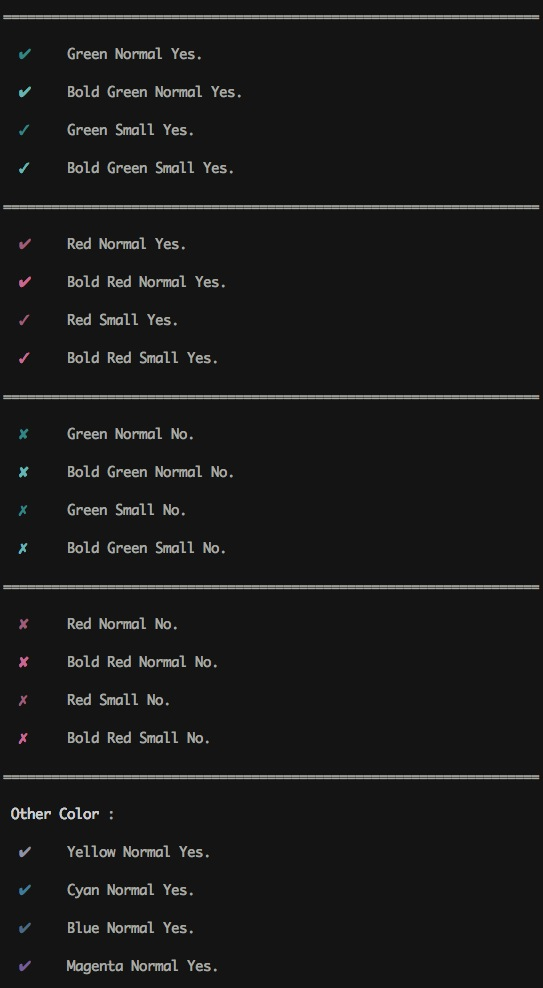
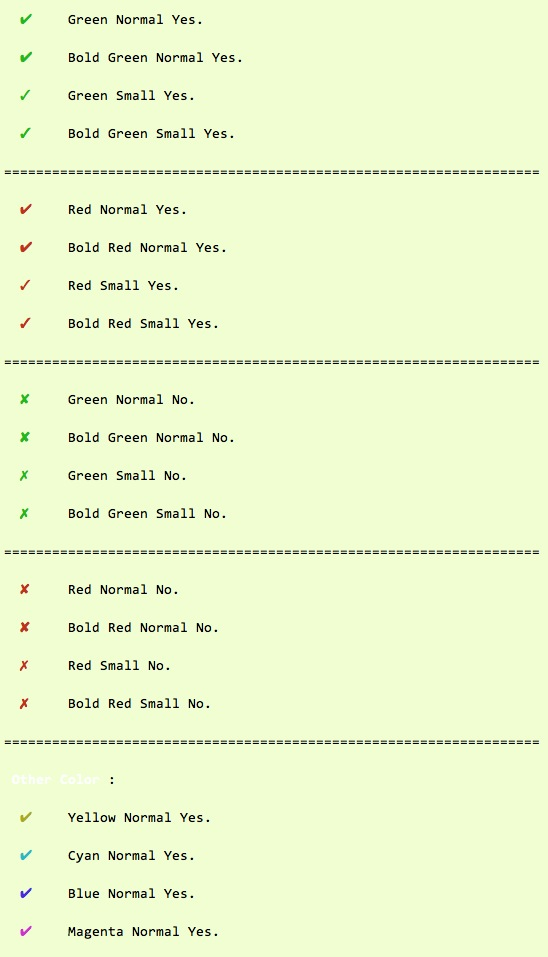

Shell Decoration
================

#The commonly used decorating in script.

## include

1. emoji. [http://www.emoji-cheat-sheet.com/]
2. color.

## usage

move decoration file to /path/to/

add `. /path/to/decoration` to your shell script.

usage defined decorated var. 

check demo.sh.

#Look like:

